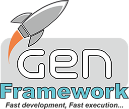

# GEN Third Party Libraries

**GEN FrameWork** uses several third-party libraries for part of its functionality that it offers. These libraries should only be present if some features of **GEN FrameWork** are used.

It is convenient that these libraries are organized in a directory and have the appropriate versions of them, although this location can be organized where necessary by changing the project files.

The suggested default organization and directory is:

**ThirdPartyLibraries struct (Default)** 
    
    GENFramework/ThirdPartyLibraries/
	 zlib  
     libpng  
     jpeglib  
     lua  
     ...  
     (rest of directories)  
    

The project files of the included applications of TEST (GENFrameWork/Tests) and GEN UTILS (GENFrameWork/Utils) refer to that default directory.

These libraries can be downloaded from the Internet because their use is public and free.

Next, you have a list of the libraries used with:
- Installation directory (suggested by default).
- Version used by GEN.
- URL of the creator.
- Download URL (if applicable)
- Additional comments for your configuration.

Additionally, to facilitate the use of FrameWork GEN you have available this download URL in which in a single compressed file is all the contents of this directory:

[Third Party Libraries URL **genframework.dyndns.org/thirdpartylibraries.zip**](genframework.dyndns.org/thirdpartylibraries.zip)

## List of third party libraries

**Name                                                                           Version**   

1. [**Anti-Grain Geometry (AGG)**](#AGG)									                       **2.5** 
1. [**Duktape**](#duktape)                                                       **2.7.0**       
1. [**FFmpeg**](#ffmpeg)                                                         **4.0**
1. [**freetype**](freetype)                                                      **2.12.1**
1. [**OpenGL Extension Wrangler Library**](opengl-extension-wrangler-library)    **1.13.0**  
1. [**InpOut 32/64**](inpout-32/64)                                              **1.5.0.1**  
1. [**jpeglib**](#jpeglib)                                                       **9e** 
1. [**libpcap**](#libpcap)                                                       **1.10.1** 
1. [**npcap SDK**](#npcap)                                                       **1.13.1** 
1. [**LibPNG**](#libpng)                                                         **1.6.40**
1. [**Lua**](#lua)                                                               **5.3.4**  
1. [**MySQL Connector C**](#mysql-connector-c)                                   **6.1.11** 
1. [**npcap**](#npcap)                                                           **1.60**
1. [**OpenAL Soft**](#openal-soft)                                               **1.1**  
1. [**OpenGL-Registry**](#opengl-registry)                                       **N/A** 
1. [**LibPQ**](#libpq)                                                           **11.1**  
1. [**rpi_ws281x**](#rpi_ws281x)											                           **N/A**
1. [**SQLite**](#sqlite)                                                         **3.23.1**  
1. [**StackWalker**](StackWalker)											                           **v5** 
1. [**STB Vorbis**](#stb)                                                        **2.31**  
1. [**Toast++**](Toast++)                                                        **1.1**  
1. [**Zlib**](#zlib)                                                             **1.2.12**        
1. [**Android NDK**](#android-ndk)								                               **r17**  
1. [**GoogleTest**](#GoogleTest)                                                 **1.12.1** + **1.10.0** 
1. [**esp-idf**](#ESP-IDF)                                                       **v5.1** 
          

## Details of third party libraries

### **AGG**

Anti-Grain Geometry (AGG) is an Open Source, free of charge graphic library, written in industrially standard C++. Basically, you can think of AGG as of a rendering engine that produces pixel images in memory from some vectorial data.

Directory        **agg**  
Version          **2.5**    
Web              **www.antigrain.com/**  
Download URL     **www.antigrain.com/download/index.html**  
Comments   

### **Duktape** 

Duktape is an embeddable Javascript engine, with a focus on portability and compact footprint. Duktape is easy to integrate into a C/C++ project.

Directory        **duktape**  
Version          **2.7.0**  
Web              **duktape.org**  
Download URL     **duktape.org/download.html**   
Comments  

### **FFmpeg**

FFmpeg is the leading multimedia framework, able to decode, encode, transcode, mux, demux, stream, filter and play pretty much anything that humans and machines have created. It supports the most obscure ancient formats up to the cutting edge. 

Directory        **ffmpeg**  
Version          **4.0**  
Web              **ffmpeg.org  www.ffmpeg.org/download.html#repositories**  
Download URL     **ffmpeg.zeranoe.com/builds/** , **sourceforge.net/projects/avbuild/files/android/**  
Comments
It´s neccesary download the binary files. Used dinamic librarys to run GEN applications.      

### **FreeType** 

FreeType is a freely available software library to render fonts.

Directory        **freetype**  
Version          **2.10.1**  
Web              **freetype.org/**  
Download URL     **gnuwin32.sourceforge.net/packages/freetype.htm**   
Comments         

### **OpenGL Extension Wrangler Library**

The OpenGL Extension Wrangler Library (GLEW) is a cross-platform open-source C/C++ extension loading library. GLEW provides efficient run-time mechanisms for determining which OpenGL extensions are supported on the target platform. OpenGL core and extension functionality is exposed in a single header file. 

Directory        **glew**   
Version          **1.13.0**  
Web              **glew.sourceforge.net/**  
Download URL     **github.com/nigels-com/glew**  
Comments         
It is necessary to modify the file glew.h.

### **InpOut 32/64**

InpOut32 is an open source windows DLL and Driver to give direct access to hardware ports (for example the parallel and serial port from user level programs. It is originally developed by the people at Logix4U for Windows 9x and 32bit variations of NT (NT/2000/XP/2003 etc.).

Directory        **InpOutBinaries**  
Version          **1.5.0.1**  
Web              **www.highrez.co.uk/**  
Download URL     **www.highrez.co.uk/downloads/inpout32/**  
Comments         
Only for Windows platform. 

### **jpeglib**  

This library is distributes by IJG (is an informal group). The first version was released on 7-Oct-1991.This is a stable and solid foundation for many application's JPEG support.

Directory        **jpeglib**  
Version          **9e of 16-Jan-2022**  
Web              **www.ijg.org**  
Download URL     **www.ijg.org/files/jpegsr9c.zip**  
Comments         **Create jconfig.h**  

### **libpcap**

The Packet Capture library provides a high level interface to packet capture systems. All packets on the network, even those destined for other hosts, are accessible through this mechanism. It also supports saving captured packets to a savefile, and reading packets from a savefile.

Directory        **libpcap**  
Version          **1.8.1**  
Web              **www.tcpdump.org**  
Download URL     **github.com/the-tcpdump-group/libpcap**  
Comments
It´s neccesary download the binary files. Used dinamic librarys to run GEN applications.

### **npcap**  (for windows)

The Packet Capture library provides a high level interface to packet capture systems. All packets on the network, even those destined for other hosts, are accessible through this mechanism. It also supports saving captured packets to a savefile, and reading packets from a savefile.

Directory        **npcap**  
Version          **1.13**  
Web              **npcap.com**  
Download URL     **npcap.com/#download**  
Comments
It´s neccesary download the binary files. Used dinamic librarys to run GEN applications.

### **LibPNG**  

LibPNG is the official PNG reference library. It supports almost all PNG features, is extensible, and has been extensively tested for over 22 years. Libpng is available as ANSI C (C89) source code and requires zlib 1.0.4 or later.

Directory        **libpng**  
Version          **1.6.40**  
Web              **www.libpng.org/pub/png/libpng.html**  
Download URL     **sourceforge.net/projects/libpng/files/libpng16/**  
Comments         
You must use the command ./configure in linux and eliminate some #defines of pngconf.h

### **Lua** 

Lua is a powerful, efficient, lightweight, embeddable scripting language. It supports procedural programming, object-oriented programming, functional programming, data-driven programming, and data description.

Directory        **lua**  
Version          **5.3.4**  
Web              **www.lua.org**  
Download URL     **www.lua.org/download.html**   
Comments  

### **MySQL Connector C**

Connector/C (libmysqlclient) is a client library for C development of MySQL.

Directory        **mysql-connector-c**  
Version          **6.1.11**  
Web              **www.mysql.com**  
Download URL     **dev.mysql.com/downloads/connector/c/** 
Comments
It´s neccesary download the binary files. Used dinamic librarys to run GEN applications.

### **npcap**

The Packet Capture library for windows provides a high level interface to packet capture systems. All packets on the network, even those destined for other hosts, are accessible through this mechanism. It also supports saving captured packets to a savefile, and reading packets from a savefile.

Directory        **npcap**  
Version          **1.60**  
Web              **nmap.org/npcap/**  
Download URL     **nmap.org/npcap/dist/npcap-sdk-1.12.zip**  
Comments
It´s neccesary download the binary files. Used dinamic librarys to run GEN applications.

### **OpenAL Soft**

OpenAL provides capabilities for playing audio in a virtual 3D environment. Distance attenuation, doppler shift, and directional sound emitters are among the features handled by the API. More advanced effects, including air absorption, occlusion, and environmental reverb, are available through the EFX extension. It also facilitates streaming audio, multi-channel buffers, and audio capture.

Directory        **openal-soft**  
Version          **1.1**  
Web              **openal-soft.org/**  
Download URL     **github.com/kcat/openal-soft**  
Comments
It´s neccesary download the binary files. Used dinamic librarys to run GEN applications.

### **OpenGL-Registry**

API and Extension registries for the OpenGL family APIs - OpenGL, OpenGL ES, and OpenGL SC. It includes API specifications; specifications of Khronos- and vendor-approved extensions; header files corresponding to the specifications; the XML API Registry definining each API; and related tools and scripts.

Directory        **OpenGL-Registry**  
Version          **Unknown**  
Web              **www.khronos.org/registry/OpenGL/**  
Download URL     **github.com/KhronosGroup/OpenGL-Registry**  
Comments
Only the header glext.h is used.

### **LibPQ**
LibPQ is part of the official PostgreSQL GIT repository. It´s the interface/connector for this SQL database.

postgres Connector  
Directory        **postgres**  
Version          **11.1**  
Web              **www.postgresql.org/**  
Download URL     **www.postgresql.org/ftp/source/**   
Comments
It´s neccesary download the binary files. Used dinamic librarys to run GEN applications.

### **rpi_ws281x**

Userspace Raspberry Pi library for controlling WS281X LEDs. This includes WS2812 and SK6812RGB RGB LEDs

Directory        **rpi_ws281x**  
Version          **n/a**  
Web              **github.com/jgarff/rpi_ws281x**  
Download URL     **github.com/jgarff/rpi_ws281x/archive/refs/heads/master.zip**   
Comments
Version only for Raspberry Pi.

### **SQLite**

SQLite is a self-contained, high-reliability, embedded, full-featured, public-domain, SQL database engine. SQLite is the most used database engine in the world. 

Directory        **sqlite**  
Version          **3.23.1**  
Web              **www.sqlite.org/index.html**  
Download URL     **www.sqlite.org/download.html**   
Comments

### **StackWalker** 

StackWalker: Way to walk a callstack for any thread (own, other and remote). It has an abstraction layer, 
so the calling app does not need to know the internals.

Directory        **StackWalker**  
Version          **v5**  
Web              **www.codeproject.com/Articles/11132/Walking-the-callstack**  
Download URL     **www.codeproject.com/KB/threads/StackWalker/stackwalker.zip**   
Comments         
This librarys are only for WINDOWS.

### **STB**  

Collection of libraries for C/C++- Most libraries by stb, except: stb_dxt by Fabian "ryg" Giesen, stb_image_resize by Jorge L. "VinoBS" Rodriguez, and stb_sprintf by Jeff Roberts.

Directory        **stb**  
Version          **2.31**  
Web              **nothings.org/stb_vorbis/**  
Download URL     **github.com/nothings/stb**  
Comments         
Need add stb_vorbis.h (OGG file format) to GEN compile. 

### **Toast++**

Toast++ is a set of C++ classes to provide an encapsulation for Toast Notifications for Desktop Win32 applications.

Directory        **Toast++**  
Version          **1.1**  
Web              **www.naughter.com/toastpp.html**    
Download URL     **www.naughter.com/download/toastpp.zip**     
Comments         
This librarys are only for WINDOWS.

### **Zlib**

A Massively Spiffy Yet Delicately Unobtrusive Compression Library. It was written by Jean-loup Gailly (compression) and Mark Adler (decompression).

Directory        **zlib**    
Version          **1.2.11**      
Web              **zlib.net/**    
Download URL     **github.com/madler/zlib**    
Comments         
You must use the command ./configure in linux.  GEN use also some .H + .C of the subdirectory contrib/minicom. 

### **Android NDK**

The Android NDK (Native Developed Kit) is a toolset that lets you implement parts of your app in native code, using languages such as C and C++. 

Directory        **android-ndk**   
Version          **r17**   
Web              **developer.android.com/ndk/**    
Download URL     **developer.android.com/ndk/downloads/**    
Comments
Only for Android platform. Only use the Android **Native App Glue**.

### **GoogleTest**

GoogleTest is a testing framework developed by the Testing Technology team with Google’s specific requirements and constraints in mind. 

Directory        **GoogleTest**    
Version          **1.12.1**   
Web              **github.com/google/googletest**    
Download URL     **github.com/google/googletest**    
Comments

### **ESP-IDF**

Espressif provides basic hardware and software resources to help application developers realize their ideas using the ESP32 series hardware. 

Directory        **ESP-IDF**    
Version          **v5.1**   
Web              **docs.espressif.com/projects/esp-idf/en/latest/esp32/index.html**    
Download URL     **github.com/espressif/esp-idf**    
Comments

